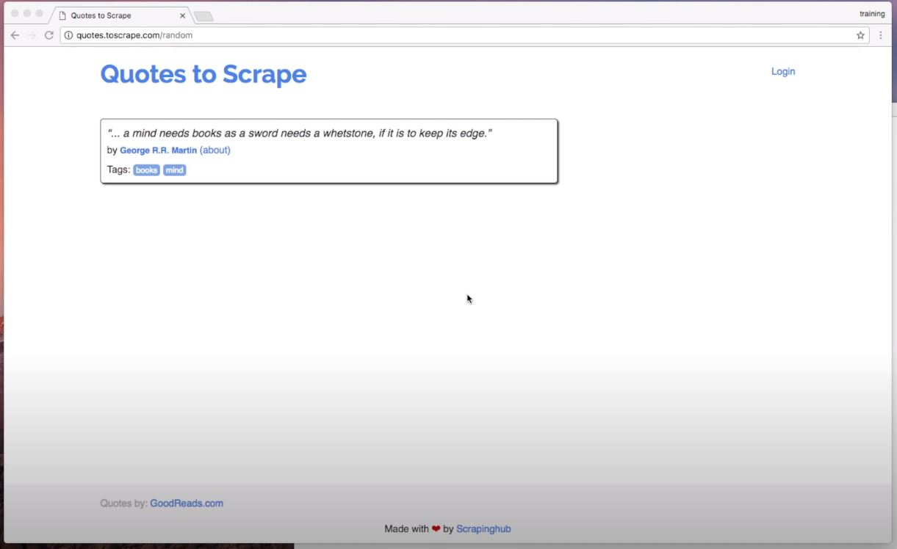
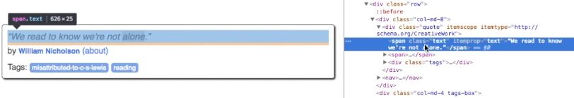
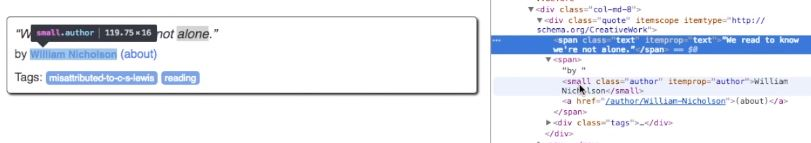
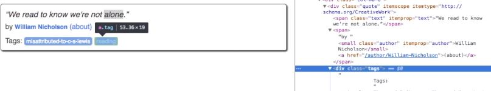

# Capitulo 1

📦 **Actualizado al:** 22/09/2020

#### Localización 🕵

Para comenzar, sepan que extraeremos datos del enlace [Quotes to Scrape](http://quotes.toscrape.com/random), que nos proveera de frases randoms.

<p align="center">
  
</p>

Extraeremos la _frase_ por un lado, el _autor_ por otro, y finalmente los _tags_.

En primer lugar, debemos identificar con el _inspector de elementos_ (devtools), que etiquetas _html_ y propiedad _css_ encierra al texto de interes.

<p align="center">
  
  
  
</p>

Puede observar que en esté caso, la _frase_ se encuentra encerrado por un elemento `span` de clase `text`. El _autor_, por otro lado, se encuentra encerrado por un elemento `small` de clase `author`. Y finalmente, los _tags_ se encuentran encerrados por elementos `a` de clase `tag`.

#### Extracción ⛏️

Ahora que localizamos lo que nos interesa extraer, procederemos a realizar la extracción:

Descargamos la página con Scrapy shell (aparte nos proveera de objetos que nos permitirán acceder al contenido de la página):

```
scrapy shell http://quotes.toscrape.com/random
```

Ahora veamos algunas funcionalidades:

```
print(response.text)
```

Nos retorna el contenido de la página en HTML plano (con las etiquetas y el css aplicado).

```
response.css('small.author').extract()
```

Nos permite acceder al css del contenido de la página en el punto que deseemos (le pasamos la etiqueta y la clase deseada para que nos devuelve aquellos que encajen con el valor indicado). Debe tener en cuenta que lo que nos devuelve es una lista.

```
response.css('small.author::text').extract()
```

Este caso es el mismo que el anterior, solo que ahora le indicamos que unicamente nos traiga el texto. Nuevamente, tenga en cuenta que es una lista con el texto de cada uno de los elementos que coinicidieron con el valor de filtro.

```
response.css('small.author::text')[0].extract()
```

Como es una lista/array, podemos decirle que nos traiga el elemento 0.

```
response.css('small.author::text').extract_first()
```

Aunque, aun mejor, si lo que deseamos es obtener solo el primer elemento, existe un metodo que nos permite exactamente hacer eso.

#### Práctica

Extraiga por su cuenta, con lo visto hasta ahora, el texto de la frase y del tag.

---

<p align="center">
  <b>Continuar aprendiendo...</b>
  <br>
  <a href="../README.md">⬅ Anterior</a>
                    🔥
  <a href="../capitulo2/README.md">Siguiente ➡</a>
</p>

---

📌 [fuente oficial](https://www.youtube.com/watch?v=vkA1cWN4DEc) y original en ingles.
