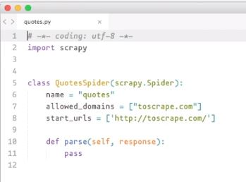
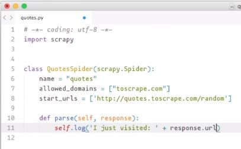
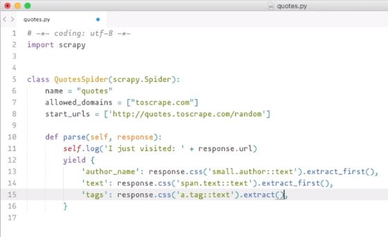
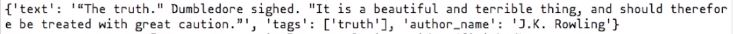

# Capitulo 2

📦 **Actualizado al:** 22/09/2020

#### Crear una Spider 🕷️

Generaremos una Spider con el comando `scrapy genspider` el cual recibe dos parametros, el primero es el nombre que le queremos dar a la Spider, y el segundo el el domino que deseamos "scrapear".

```
scrapy genspider quotes toscrape.com
```

Ahora, abrimos el archivo generado con el editor que más nos guste:

```
subl quotes.py
```

Y veremos un código autogenerado con el siguiente formato:

<p align="center">
    
</p>

Describamos lo que vemos:

- El código está redactado en Python.
- Se importa la librería de srapy.
- Se creo una clase llamada QuotesSpider que recibe una Spider.
- Se creo una variable nombre con el valor quotes pasado por parametro.
- Se creo una variable dominios permitodos con el valor del dominio pasado por párametro (que de momento no necesitamos).
- Se creo una variable enlace de inicio con el valor del dominio pasado por parámetro. Está la tenemos que modificar por el enlace [Quotes to Scrape](http://quotes.toscrape.com/random) que venimos trabajando. Notese que es un subdominio del dominio que pasamos por parámetro.
- Se definió un método llamado "parse" que recibe la instancia de la clase y un response.

Podemos utilizar este método definido para imprimir por pantalla un mensaje donde indiquemos la página que se está vicitando.

<p align="center">
    
</p>

Para ver el resultado, solo corra el siguiente comando por consola:

```
scrapy runspider quotes.py
```

Como habrá notado, al correr el comando, nos imprime mucha información relacionada a la ejecución, y mas o menos al medio de todo, se encontrará el log que le indicamos que imprima en el código.

#### Automatizar el proceso de extracción 🕸️

Creamos un diccionario que contengan los datos que deseamos extraer con los respectivos selectores que utilizamos en el [capitulo anterior](../capitulo1/README.md).

<p align="center">
    
</p>

Ahora al correr la Spider podrá notar que entre toda la información que se imprimio en consola, existe un objeto con un formato JSON del diccionario definido y con los valores que los selectores retornan.

<p align="center">
    <br>
    
    <br>
</p>

Finalmente, si queremos, podemos exportar el resultado a un archivo con el comando:

```
scrapy runspider quotes.py -o items.json
```

El flag `o` indica *output* y el argumento que le sigue, es el nombre del archivo donde se guardará la información. El archivo solo contendrá el objeto JSON que mencionamos.

---

<p align="center">
  <b>Continuar aprendiendo...</b>
  <br>
  <a href="../capitulo1/README.md">⬅ Anterior</a>
                    🔥
  <a href="../capitulo3/README.md">Siguiente ➡</a>
</p>

---

📌 [fuente oficial](https://www.youtube.com/watch?v=qPvPiMbPSTE) y original en ingles.
