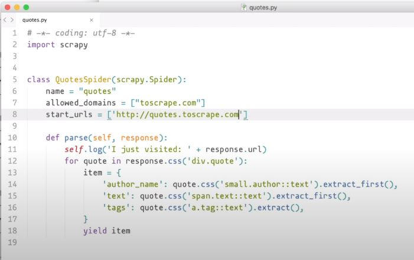

# Capitulo 3

📦 **Actualizado al:** 23/09/2020


#### Extracción múltiple  👷‍♀️👷‍♂️

Volvamos al utilizar `scrapy shell`. Descarguemos el contenido de nuestra pagina de prueba [Top Ten Quotes to Scrape](http://quotes.toscrape.com).

```
scrapy shell 'http://quotes.toscrape.com'
```

Ahora, prueba correr los selectores que ya venimos utilizando para obtener las frases, los autores y los tags.

```
response.css('span.text::text').extract()
response.css('small.author::text').extract()
response.css('a.tag::text').extract()
```

Si los corriste uno a uno, notaras que los `span` y los `small` eran 10, donde si lo pensamos como un Array, el elemento `n` de la lista de *autores* coinicida con el elemento `n` de la lista de *frases*. Pero, los *tags* no tenemos forma de identificarlos puesto que una *frase* puede tener varios *tags*, y la lista que generamos tiene un número mucho mayor a la cantidad de elementos que estamos analizando en terminos generales.

Volvamos a inspeccionar el navegador y veamos como podemos solucionarlo.

<p align="center">
    
</p>

Fijate que cada frase está encerrada por una etiqueta `div` de clase `quote`. Lo que podemos hacer, es iterar extrayendo las claves que ya veniamos extrayendo, pero ahora de cada elemento de la lista que nos obtendria extraer el `div.quote`. Corra los siguientes comandos uno a uno y vea los resultados para entender a que nos referimos:

```
response.css('div.quote')
firstQuote = response.css('div.quote')[0]
firstQuote.css('span.text::text').extract_first()
firstQuote.css('small.author::text').extract_first()
firstQuote.css('a.tag::text').extract()

```

Ahora que entendimos la lógica, podemos iterrar la lista con, por ejemplo, un ciclo `for`:

```python
for quote in response.css('div.quote'):
    item = {
        'text': quote.css('span.text::text').extract_first(),
        'author_name': quote.css('small.author::text').extract_first(),
        'tags': quote.css('a.tag::text').extract_first()
    }
    print(item)
```

Finalmente podemos, al igual que antes, automatizar su ejecución incluyendolo en una Spider:

<p align="center">
    
</p>

Y correrlo guardando su resultado en un archivo:

```
scrapy runspider quotes.py -o quotes.json

```

El archivo debería contener algo así:

<p align="center">
    
</p>

---

<p align="center">
  <b>Continuar aprendiendo...</b>
  <br>
  <a href="../capitulo2/README.md">⬅ Anterior</a>
                    🔥
  <a href="../capitulo4/README.md">Siguiente ➡</a>
</p>

---

📌 [fuente oficial](https://www.youtube.com/watch?v=E6lOVwigsNA) y original en ingles.
