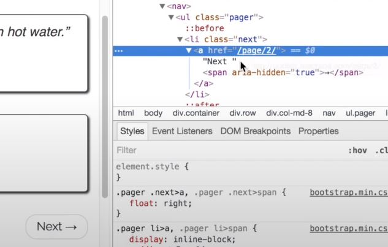
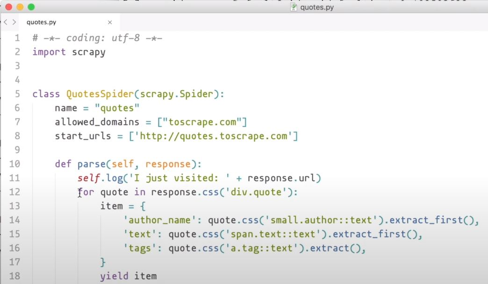
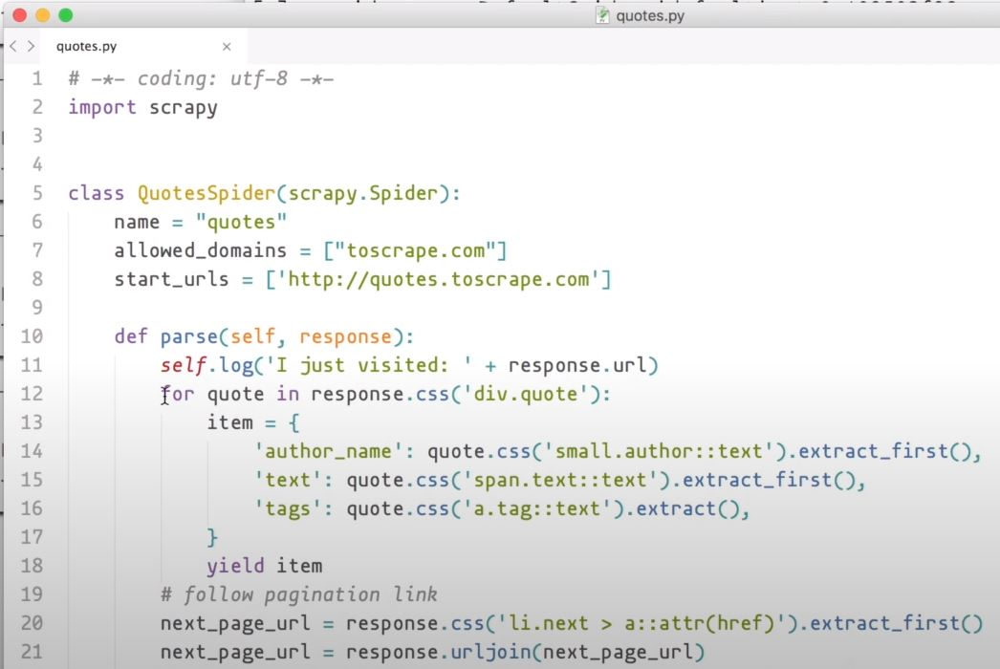
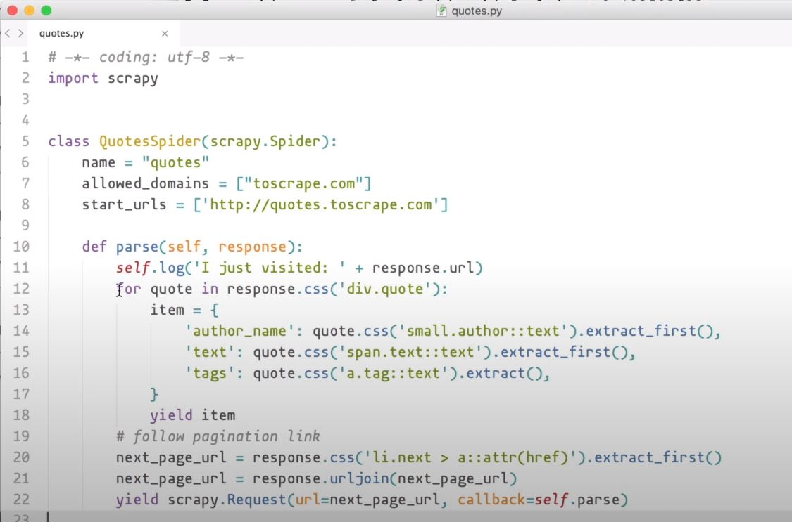
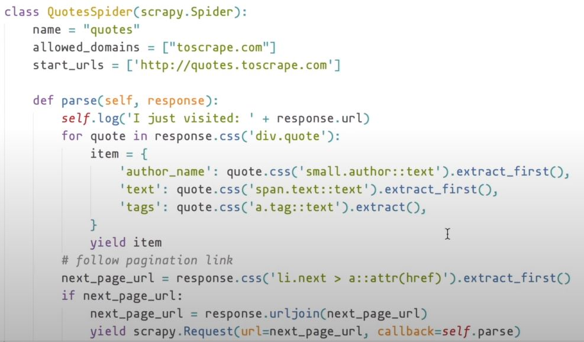

# Capitulo 4

📦 **Actualizado al:** 23/09/2020


#### Saltando a través de páginas 🦘

Cuando hablamos de Crawl nos referímos a la habilidad de poder salgar de una pagina a otra a travez de hipervinculos. Para lograr que nuestra Spider puede realizar esto, nos encargaremos de encontrar un patrón que nos permita determinar de una web scrapeada, cual es el siguiente salto para dar.

Volviendo al ejemplo que venimos trabajando, veamos que en el ultimo ejemplo, trabajamos con el contenido de nuestra pagina de prueba [Top Ten Quotes to Scrape](http://quotes.toscrape.com). Como se puede observar, al final de la página se encuentra un botón de *siguiente*, el cual nos permite cambiar efectivamente de página. Si nuestra intención fuese scrapear todas las páginas que posee el enlace, podriamos scrapear la primera página, luego leer el hipervinculo que contiene el elemento del botón *next*, para finalmente hacer una nueva petición de scraping a esté enlace. 

Hagamos estó, vamos a inspe|ccionar el navegador y veamos que elementos contienen el enlace de interes.

<p align="center">
    
</p>

Como se puede ver, tenemos una etiqueta `li` de clase *next* que encierra una etiqueta `a` la cual en su propiedad *href* contiene la dirección de la página siguiente. Implementemos el código para efectuar está extracción. Primero volvemos a utilizar `scrapy shell` para descargarnos la página:

```
scrapy shell 'http://quotes.toscrape.com'
```

Comenzamos obteniendo el objecto selector para la etiqueta `a`:

```
response.css('li.next > a')
```

Ahora podriamos limpiar un poco extrayendo el primer elemento de la lista de objetos:

```
response.css('li.next > a').extract_first()
```

Finalmente, nos queda extraer el contenido dentro del atributo *href* de la etiqueta `a`:

```
response.css('li.next > a::attr(href)').extract_first()
```

Sin embargo, este string que nos trae es una ruta relativa, mientras que nosotros, necesitamos la ruta absoluta. Por lo tanto, lo que debemos hacer es unir la URL de la página que scrapeamos con la ruta relativa recien obtenida. Esto lo podemos lograr así:

```
next_page_relative_url = response.css('li.next > a::attr(href)').extract_first()
response.urljoin(next_page_relative_url)
```

Hasta ahora solo obtuvimos la nueva ruta a la que queremos acceder para scrapear. Lo que tenemos que hacer ahora es crear la petición de scraping. Volvamos al código, hasta ahora teniamos algo así:

<p align="center">
    
</p>

Pero ahora, incluiremos lo que hemos aprendido para extraer la nueva ruta que queremos scrapear:

<p align="center">
    
</p>

Y finalmente para generar una nueva petición con este nuevo enlace, contamos con `scrapy.Request` que recibe dos parámetros: en primer lugar el enlace, y en segundo lugar la función que va a ejecturar. Para nuestra necesidad particular, el enlace que le pasaremos es el que obtuvimos, y la función que ejecutaría sería la misma que hace el primer scrapeo. Por lo tanto, el código que incluimos a nuestra Spider es entonces:

```python
next_page_url = response.css('li.next > a::attr(href)').extract_first()
next_page_url = response.urljoin(next_page_url)
yield scrapy.Request(url=next_page_url, callback=self.parse)
```

Quedando nuestra Spider así:

<p align="center">
    
</p>

Está función de *parse* que creamos, ahora se ha convertido en una función *recursiva* que se ejecutará hasta no encontrar más páginas para scrapear. Pero ojo, para que el proceso entienda que no existen más páginas debemos añadir un condincional que se encargue de validar si la *url* obtenida es válida. 

<p align="center">
    
</p>

Solo nos queda correr la Spider y ver los resultados
```
scrapy runspider quotes.py
```

Podemos mirar algunos parámetros útiles en el *log* generado por la corrida. `item_scraped_count` nos indica la cantidad de elementos que se obtuvieron en la corrida y `downloader/request_count` nos indica la cantidad de elementos que fueron extraidos por página.

---

<p align="center">
  <b>Continuar aprendiendo...</b>
  <br>
  <a href="../capitulo3/README.md">⬅ Anterior</a>
                    🔥
  <a href="../capitulo5/README.md">Siguiente ➡</a>
</p>

---

📌 [fuente oficial](https://www.youtube.com/watch?v=G9Nni6G-iOc) y original en ingles.
