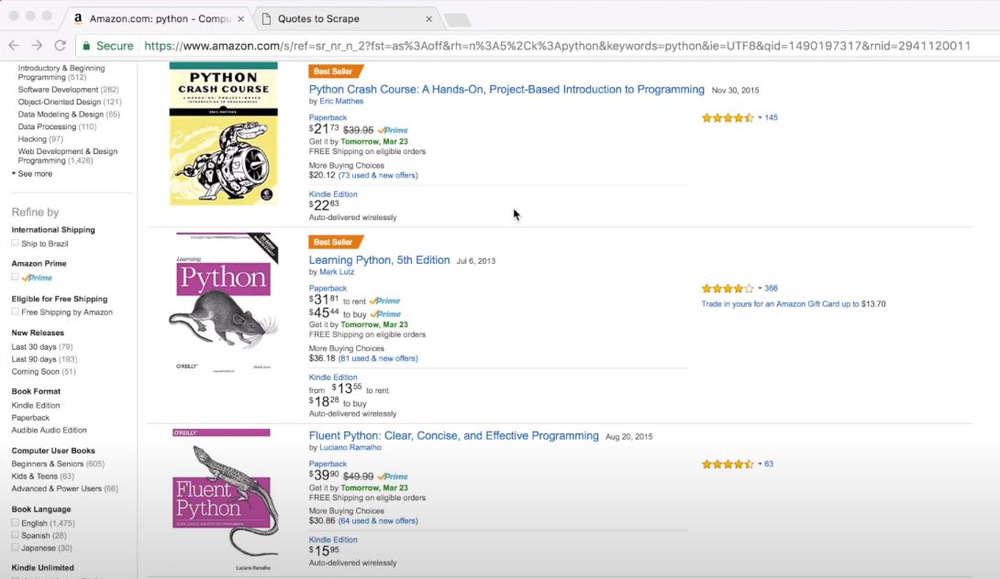
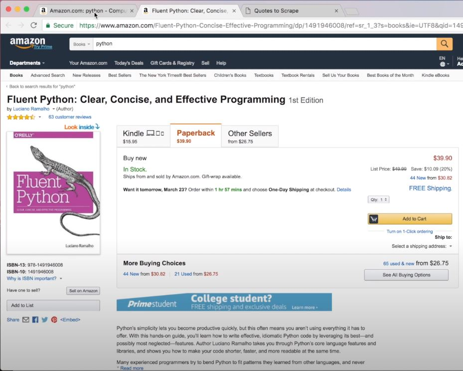
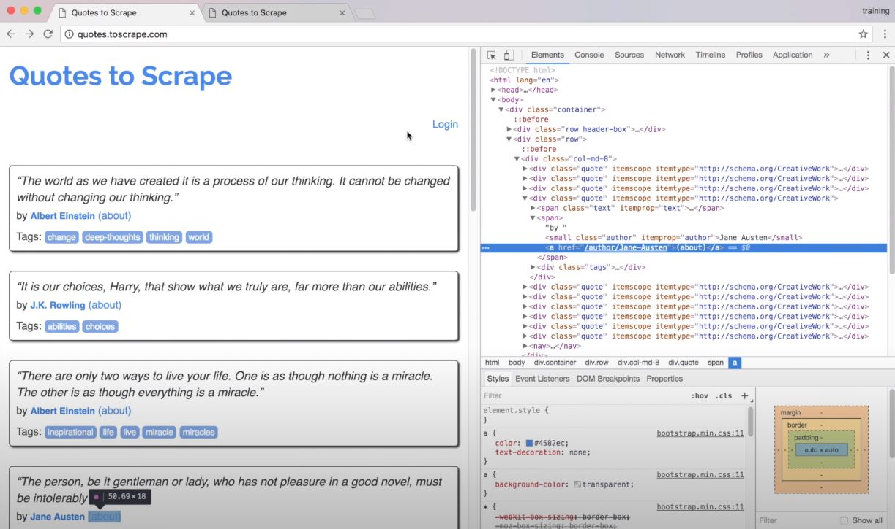
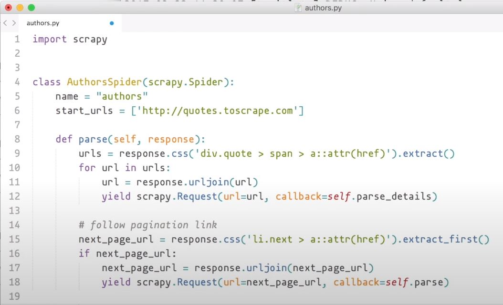
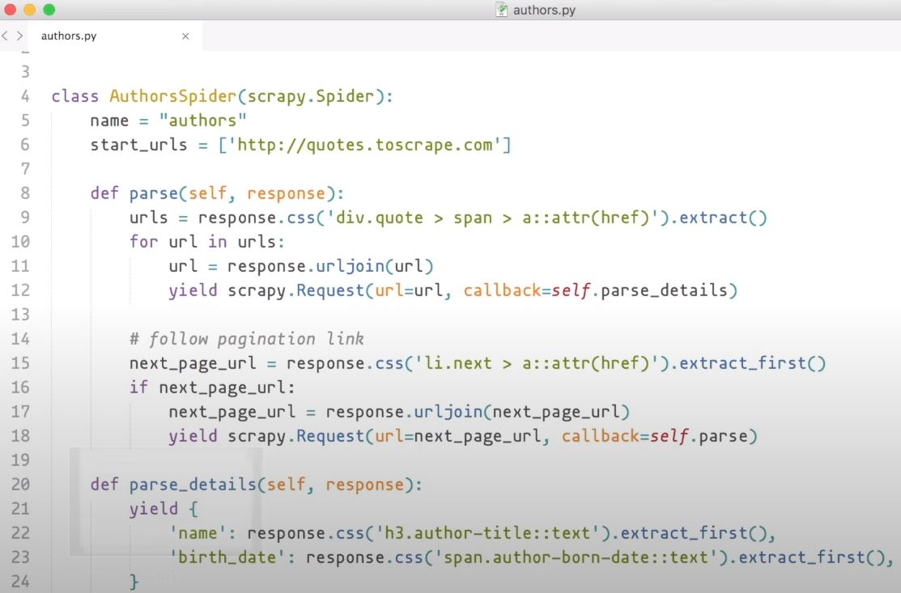

# Capitulo 5

📦 **Actualizado al:** 24/09/2020


#### Extracción de datos de un e-commerce 🌐

Trabajemos ahora con un ejemplo más avanzado como podría ser extraer información de una página como puede ser [Amazon](https://www.amazon.com/). Para esté ejemplo generaremos la busqueda de *python* y probablemente nos traiga una lista de libros. En primer lugar, accedamos en alguno de estos libros listados y veamos como se estructura.

<p align="center">
    
</p>
<p align="center">
    
</p>

Como podemos ver, para cada elemento de nuestra lista de libros tenemos un enlace que nos redirecciona a un libro en especifico, y finalmente, al acceder a cualquier libro,vemos que nos expone información específica repartida por todo el documento. 

Volvamos al ejemplo que veniamos trabajando de nuestra página de prueba [Top Ten Quotes to Scrape](http://quotes.toscrape.com). Como podrán notar tenemos el mismo patrón. Cada frase tiene un enlace *about* que, si accedemos, nos muestrá información específica del autor.

Utilicemos las devtools para inspeccionar el elemento que compone el *about*

<p align="center">
    
</p>

Como podemos ver, esta encerrado por una etiqueta `div` de clase *quote*, que a su vez encierra un conjunto de etiquetas `span` donde la segunda etiqueta es la que nos interesa, pues finalmente encierra una etiqueta `a` que tiene la ruta relativa que estamos necesitando extraer. Como venimos haciendo, descarguen la página con la `shell`:

```
scrapy shell 'http://quotes.toscrape.com'
```

Y ahora realicemos la extracción necesaria:

```
response.css('div.quote > span > a::attr(href)').extract()
```

En primer lugar, podemos ver que el resultado, es un conjunto de rutas relativas que nos indican donde acceder para ver la información del autor. Lo que haremos es acceder a cada uno de estos enlaces y extraer la información de cada autor. Por lo tanto, vamos a crear una nueva constante con la lista que obtenemos con el Selector, y la iteraremos para luego concatenarla con la dirección absoluta del enlace. Con esta dirección final, debe generar una nueva Request y delegar la responsabilidad de extraer la información del autor a otra función.

<p align="center">
    
</p>

Para ir cerrando, desarollamos está nueva función `parse_details` encargada de extraer el nombre y fecha de cumpleaños del autor.

<p align="center">
    
</p>

Finalmente, corremos la Spider y guardamos el resultado en un archivo JSON:

```bash
scrapy runspider authors.py -o authors.json
```

Y como podrán ver, tendremos en `item_scraped_count` la cantidad de items que logramos extraer.


---

<p align="center">
  <b>Continuar aprendiendo...</b>
  <br>
  <a href="../capitulo4/README.md">⬅ Anterior</a>
                    🔥
  <a href="../capitulo6/README.md">Siguiente ➡</a>
</p>

---

📌 [fuente oficial](https://www.youtube.com/watch?v=JW_FxkSohkA) y original en ingles.
