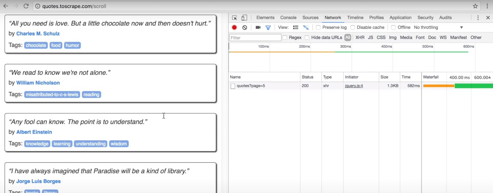
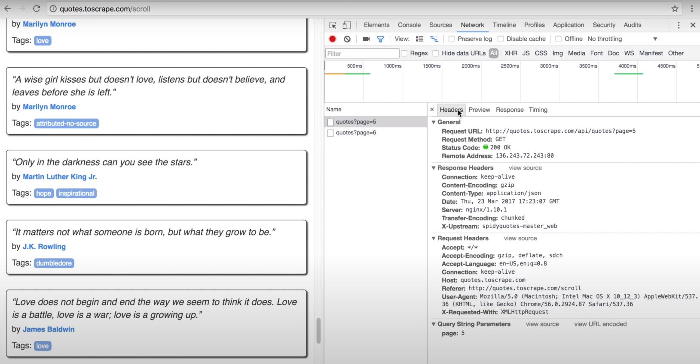
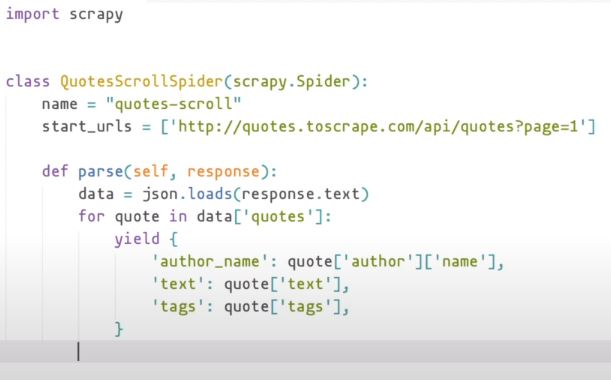
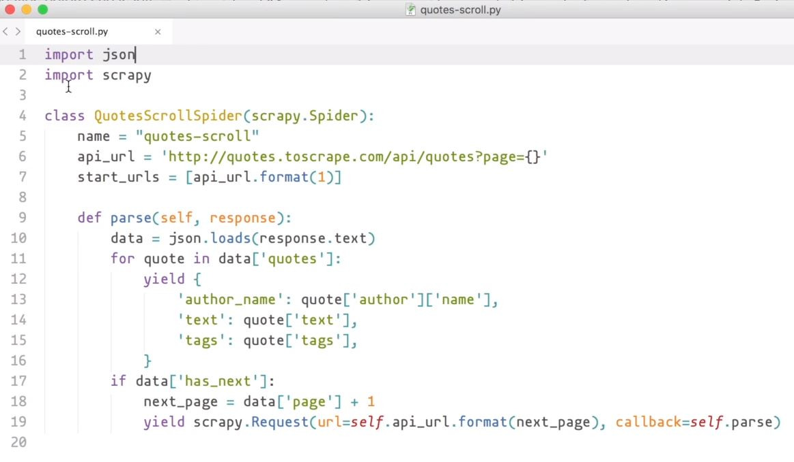

# Capitulo 6

📦 **Actualizado al:** 24/09/2020

#### Extración de páginas con Scroll infinito ♾️

Ahora veremos como resolver el problema de extración cuando se trata de páginas que tengan scroll infinito. Como página de prueba seguiremos con [Quotes to Scrape](http://quotes.toscrape.com) pero en su [versión Scrolling](http://quotes.toscrape.com/scroll).

En primer lugar debemos saber que las páginas que tienen este patrón suelen captar cuando estás en el final de la página para solicitar una carga de más elementos. Por lo tanto, abran el inspector de elementos y diriganse a la pestaña Network.

Ahora, hagan scroll a la página hasta llegar a un punto donde se cargan más datos. Como podrán ver ahora se cargará una request de tipo xhr y status 200 en la lista.

<p align="center">
    
</p>

Si seguimos scrolleando veremos que se cargan más resultados en la lista. Si hacemos click en un elemento de la lista de Network podremos más información al respecto.

<p align="center">
    
</p>

Ahora, en la sub-pestañas que desplegua el detalle de una request seleccionada, nos expone en su pestaña Header la información detallada del request. En su pestaña Preview está la información que necesitamos scrapear en formato JSON, por lo tanto, podemos generar esta misma request desde Scrapy para obtener estos resultados y luego extraerlos con un JSON parser.

Empecemos copiandonos la Request URL y ejecutandola en la consola:

```bash
scrapy shell http://quotes.toscrape.com/api/quotes\?page\=5
```

El cuerpo de la respuesta que obtendremos es de formato JSON string, por lo tanto, para verlo más proligo nos combiene ejecutar:

```bash
print(response.text)
```

Ahora podemos importar una librería llamada json y cargarlo en una variable que usaremos como diccionario:

```bash
import json
data = json.loads(response.text)
data.keys()
```

Esta ultima ejecución nos devolverá las claves para acceder al diccionario. Es decir, nos retornará algo así:

```bash
dict_keys(['has_next', 'tag', 'top_ten_tags', 'page', 'quotes'])
```

Por lo tanto, comencemos leyendo la key de *quotes* ejecutando `data['quotes']`. Podemos ver que tiene varios elementos, veamos que tiene el primero con `data['quotes'][0]`. Creo que ya se comprendió lo que estamos haciendo:

```python
data['quotes'] # vemos que tiene varios elementos
data['quotes'][0] # traemos el primero y notamos que tiene autor, tags y texto.
data['quotes'][0]['author'] # traemos el autor y vemos que tiene nombre y otros atributos.
data['quotes'][0]['author']['name'] # y ahora solo resta el texto y los tags
data['quotes'][0]['text']
data['quotes'][0]['tags']
```

Podemos concluir que todos los datos que necesitamos extraer pueden ser tomados de este diccionario. Veamos los otros elementos del diccionario, como puede ser *has_next*. Este atributo es importante porque nos indica cuando podemos seguir solicitando páginas. En el instante que el valor sea False, sabemos que llegamos al final.

Luego, tenemos la key *page* que nos indica en que página estamos parados y por lo tanto, a que página le pertenecen las frases que pudimos extraer en este JSON.

Ahora que ya conocemos toda la estructura, podemos replicar lo que ya conocemos para crear una Spider que extraiga estos datos. El código resultante debe ser:

<p align="center">
    
</p>

Pero hasta este punto, solo lograremos extraer los elementos de la pagina 1. Por lo tanto, para lograr extraer para todas las páginas que tenga, debemos crear un condicional que evalue el key *has_next* y que mientras este sea positivo, aumentemos el numero de página para luego generar una nueva solicitud con nuestra URL modificada y ejecutando recursivamente nuestra función `parse`. Entonces, no debería quedar algo así:


<p align="center">
    
</p>

Procedemos a ejecutar la Spider ahora y ver que obtenemos:

```
scrapy runspider quotes-scroll.py -o quotes.json
```

Podemos ver la cantidad de items que obtuvimos observando el parametro `item_scraped_count`. También podemos ver los resultados en el archivo JSON donde los exportamos:

```
more quotes.json 
```


---

<p align="center">
  <b>Continuar aprendiendo...</b>
  <br>
  <a href="../capitulo5/README.md">⬅ Anterior</a>
                    🔥
  <a href="../capitulo7/README.md">Siguiente ➡</a>
</p>

---

📌 [fuente oficial](https://www.youtube.com/watch?v=EelmnSzykyI) y original en ingles.
