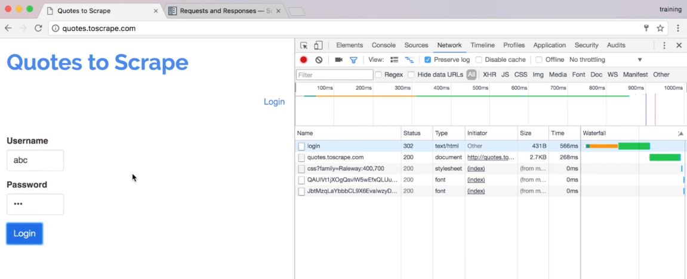
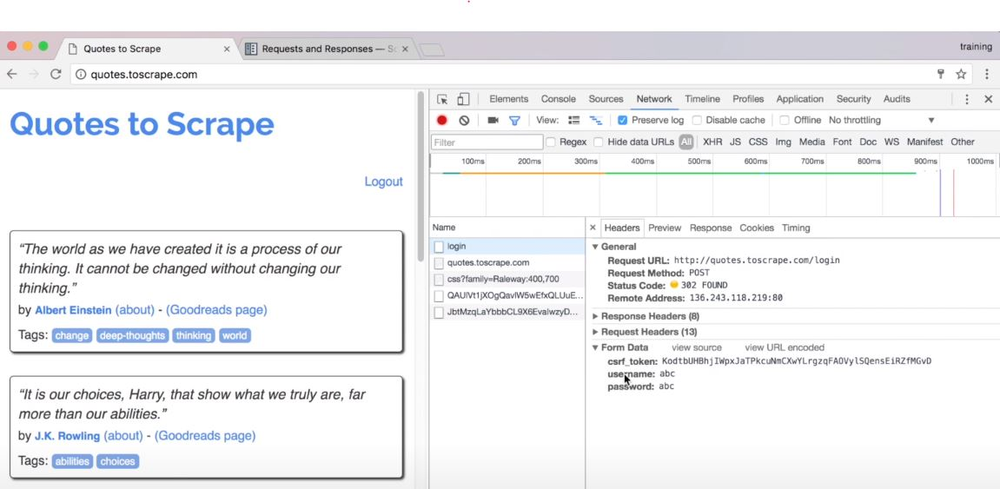
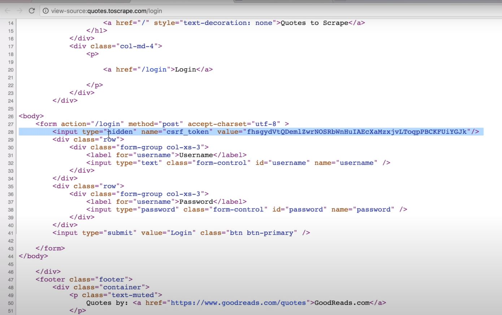
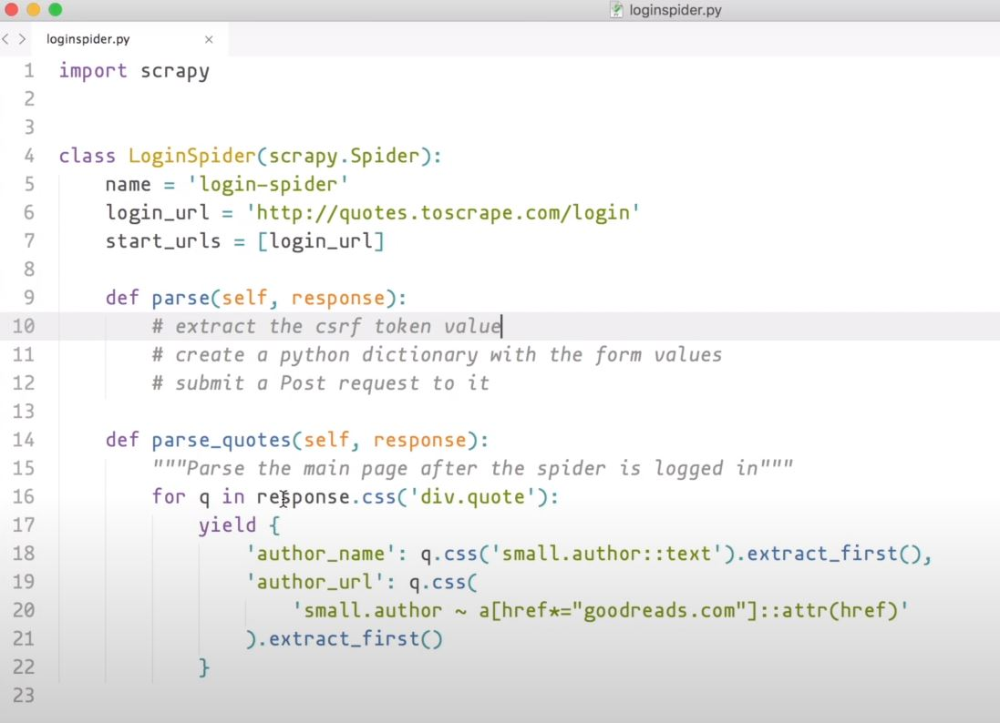
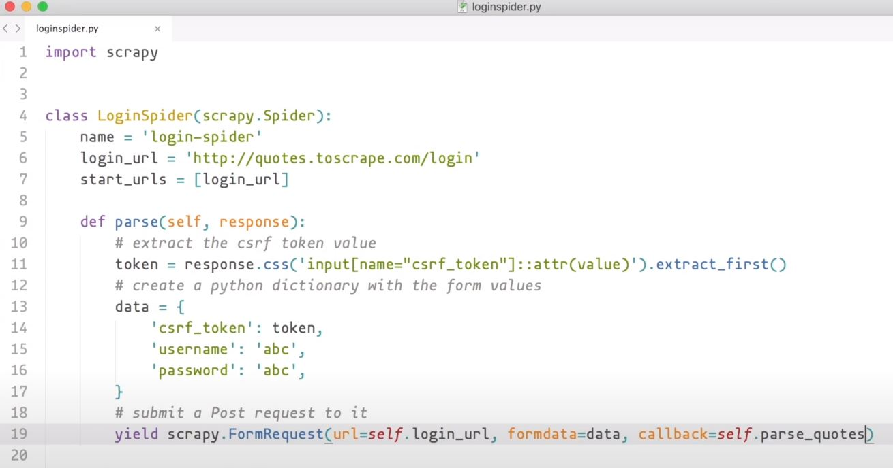

# Capítulo 7

📦 **Actualizado al:** 25/09/2020

#### Envio de formulario con Scrapy 📨

Muchas veces nos encontramos con el obstaculo de que para acceder a cierta información necesitamos completar un formulario, esto puede ser, por ejemplo, un login en una página para poder visibilizar el contenido. En este capitulo aprenderemos a resolver estos problemas.

Lo que vamos a necesitar hacer es un request de método POST con la data y la estructura necesaria para garantizar el cumplimiento del formulario. 

Seguiremos con nuestra [página de ejemplo](http://quotes.toscrape.com/). En este caso, nos loguearemos para que ademas de ver la frase con su autor y tags, tambien podamos ver un enlace a *[Goodreads](https://www.goodreads.com/)* para cada frase.

Comencemos accediendo al inspector de elemento en la [página de login](http://quotes.toscrape.com/login) de Quotes to Scrape. Utilizaremos el inspector de Red (solapa de Network que utilizamos en el capítulo anterior). Recuerden tener marcada la opción de *"preserve log"* para que las solicitudes que vaya generando la página queden registradas en el listado.

Ahora, lo que deben hacer es ingresar una contraseña y password, ejemplo *"abc"* y como notarán inmediatamente les generará un conjunto de request que se verán en la lista de requests. Ademas, automaticamente los redireccionará a la página de inicio donde ahora sí, podran ver las frases de siempre sumado a un nuevo hipervinculo de Goodreads para cada frase.

<p align="center">
    
</p>

Ahora, seleccionen el primer elemento de la lista (*login*) para que analicemos el detalle de su petición.

<p align="center">
    
</p>

Como ya les adelanté, el método que realiza es del tipo *POST* y en el *DropList* llamado "Form Data" pueden ver que estructura tiene el dato enviado. En este caso, envia al servidor: un *token*, el *username* que le pusimos en el form y el *password* que también pusimos en el form.

Lo que debemos hacer ahora es analizar la estructura HTML que tiene la pantalla de *login*.

<p align="center">
    
</p>

Como podemos ver existe una etiqueta `input` que se encuentra escondida, pero que está autocompletada con el token en su parámetro `value`. Por lo tanto, si nosotros por ejemplo quitamos ese input, el servidor devolvería error, ya que necesita ese token para garantizar como protocolo de seguridad que el acceso está se está dando de manera correcta.

**Les encargo como tarea** que con lo que ya vimos, hagan un Script para extraer el autor y el enlace a Goodreads para cada frase de autor estando logueado. **Spoiler**, les debería quedar algo así:

<p align="center">
    
</p>

Perfecto, ahora necesitamos: 
- Aregarle la extracción del token como ya lo habiamos analizado.
- Crear el diccionario de dato con la información que queremos enviar al server.
- Crear la request con tipo POST, haciendo uso de `scrapy.FormRequest()`.

Como resultado final, nuestro código sería:

<p align="center">
    
</p>

Prueba corriendo la Spider:

```bash
scrapy runspider loginspider.py
```

---

<p align="center">
  <b>Continuar aprendiendo...</b>
  <br>
  <a href="../capitulo6/README.md">⬅ Anterior</a>
                    🔥
  <a href="../capitulo8/README.md">Siguiente ➡</a>
</p>

---

📌 [fuente oficial](https://www.youtube.com/watch?v=Lo3aswJ7lzw) y original en ingles.
