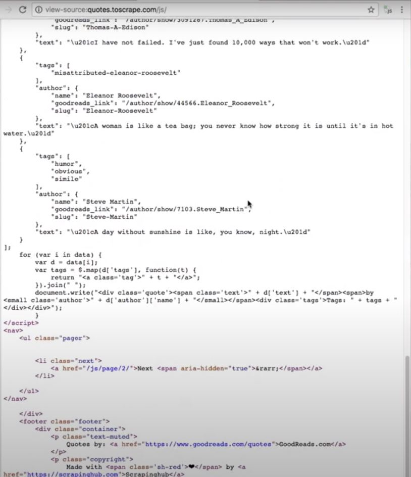

# Capítulo 8

📦 **Actualizado al:** 14/08/2020

#### Escrapear javascript de páginas, con Scrapy y Splash ⛏️

En este capítulo vamos a scrapear el mismo proyecto de Quotes to Scrape pero en su [versión javascript](http://quotes.toscrape.com/js/). Si abren este enlace con el inspector de eleméntos, podran ver que las frases están siendo cargadas con código en javascript:

<p align="center">
    
</p>

Bien, en primer lugar debemos instalar una imagen docker de Splash y levantarla para poder darle uso. Luego, en nuestro proyecto de Scrapy vamos a instalar la lib **scrapy-splash** que nos brinda todas las funcionalidades que ofrece Splash, adaptadas para python. Estos son los comandos que necesitamos ejecutar:

```bash
docker pull scrapinghub/splash
docker run -p 8050:8050 scrapinghub/splash
pip install scrapy-splash
```

Una vez instaladas las herramientas, procedemos a crear el archivo **settings.py** que deberá contener los siguientes parámetros de configuración:

```py
# -*- coding: utf-8 -*-
BOT_NAME = 'splash_based_project'

SPIDER_MODULES = ['splash_based_project.spiders']
NEWSPIDER_MODULE = 'splash_based_project.spiders'

SPLASH_URL = 'http://localhost:8050'
DOWNLOADER_MIDDLEWARES = {
    'scrapy_splash.SplashCookiesMiddleware': 723,
    'scrapy_splash.SplashMiddleware': 725,
    'scrapy.downloadermiddlewares.httpcompression.HttpCompressionMiddleware': 810,
}
SPIDER_MIDDLEWARES = {
    'scrapy_splash.SplashDeduplicateArgsMiddleware': 100,
}
DUPEFILTER_CLASS = 'scrapy_splash.SplashAwareDupeFilter'
```

Ahora, debemos adaptar nuestro código para poder hacer uso de Splash y así lograr extraer los mismos parámetros que ahora están siendo renderizados por medio de javascript en la página. Pora lograr esto, reemplazaremos la función `scrapy.Request` por `SplashRequest` (no debemos olvidar importar la librería `from scrapy_splash import SplashRequest`). Finalmente, podemos correr la Spider de nuevo y ver que el resultado es el mismo:

```
scrapy crawl quotesjs
```

---

<p align="center">
  <b>Continuar aprendiendo...</b>
  <br>
  <a href="../capitulo7/README.md">⬅ Anterior</a>
                    🔥
  <a href="../capitulo9/README.md">Siguiente ➡</a>
</p>

---

📌 [fuente oficial](https://www.youtube.com/watch?v=VvFC93vAB7U) y original en ingles.
