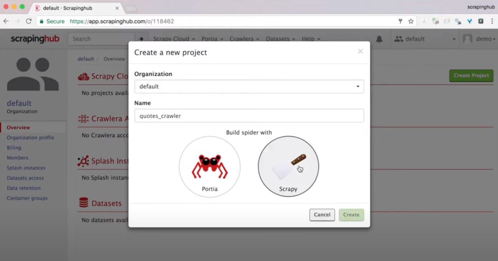
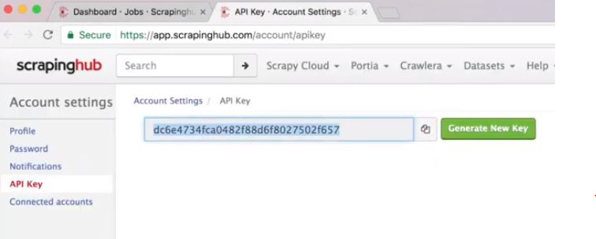
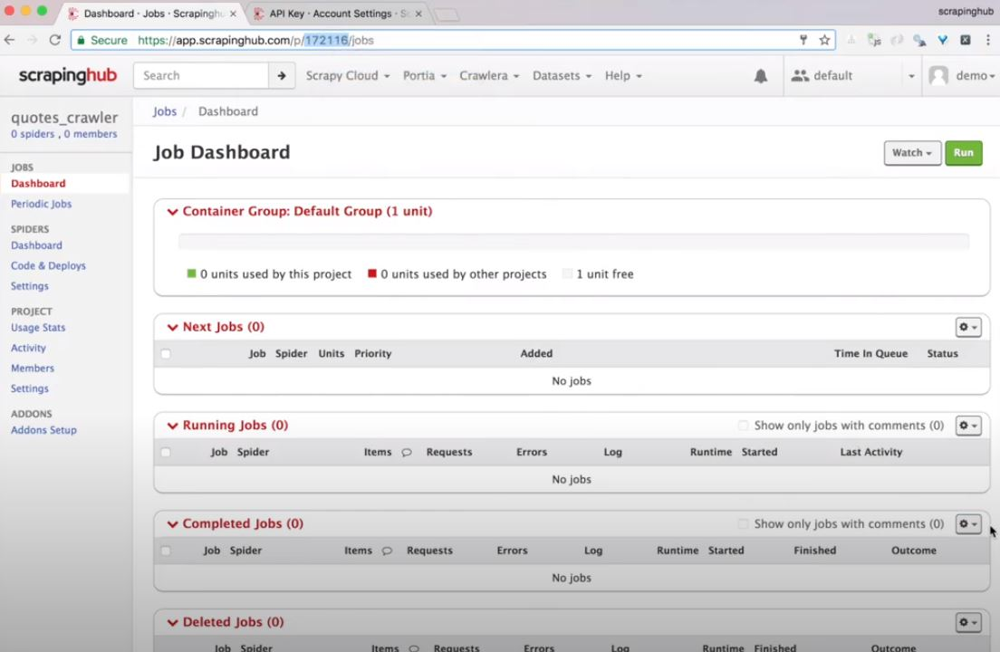
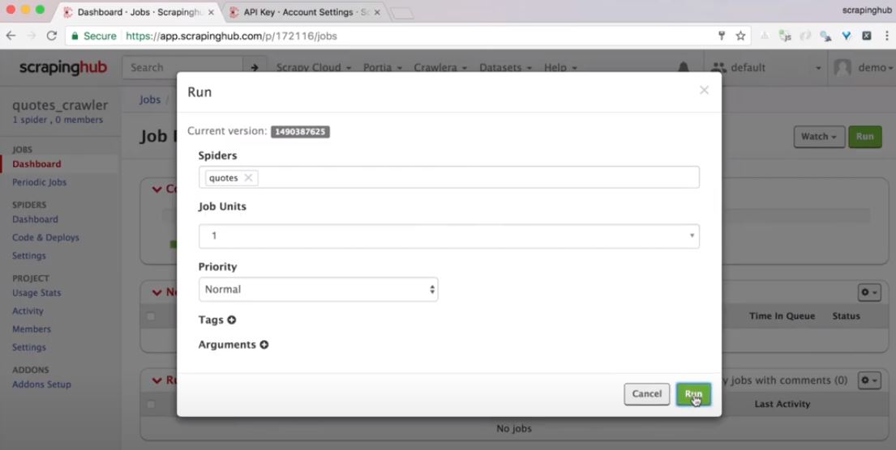
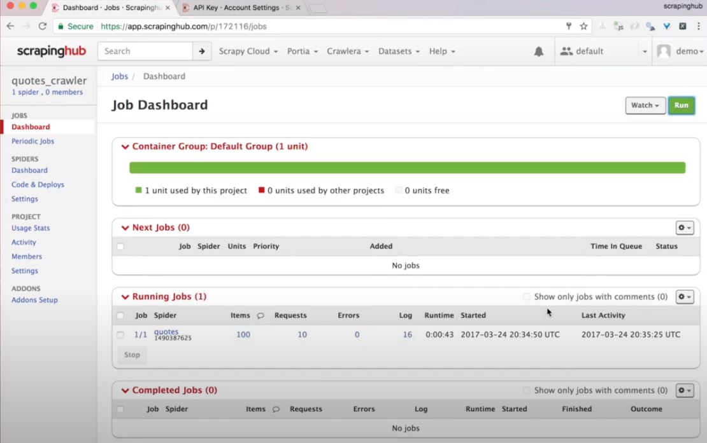
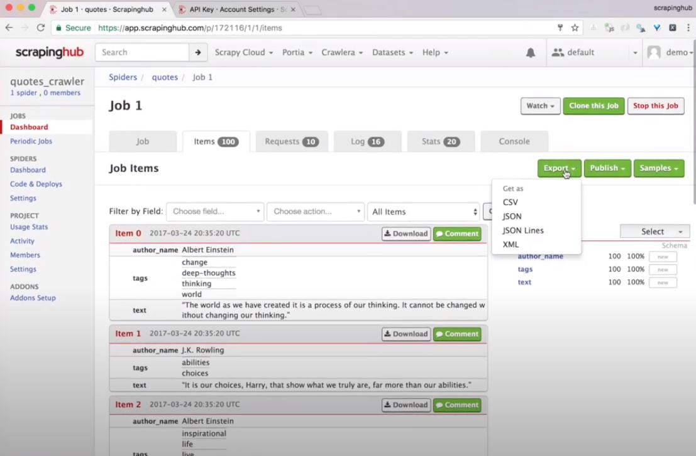
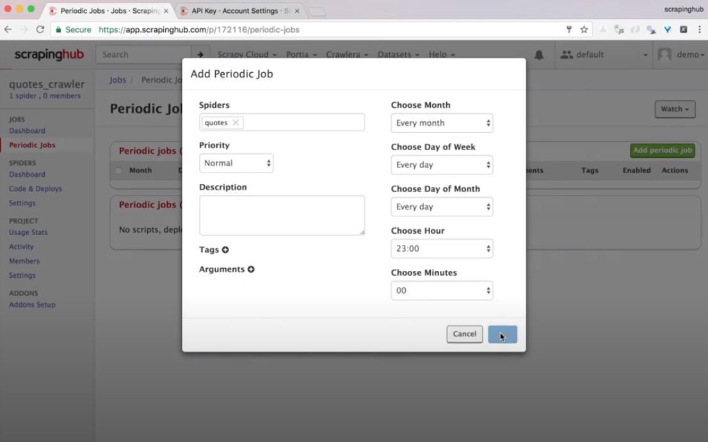

# Capítulo 9

📦 **Actualizado al:** 25/09/2020

#### Correr una Spider en un Cloud ⛏️

Para comenzar, crearemos un nuevo proyecto llamado _quotes_crawler_:

```bash
scrapy startproject quotes_crawler
cd quotes_crawler
```

Podemos ver que se nos crean un conjunto de documentos, pero lo que nos interesa es la carpeta _spiders_ donde debemos poner toda las spiders que deseemos correr. En nuestro caso, copiaremos el proyecto que ya veniamos trabajando dentro de la carpeta _spiders_:

```bash
cp ../quotes.py ./quotes_crawler/spiders
```

Podemos listar las spiders que tenemos con el comando:

```bash
scrapy list
```

Para nuestro ejemplo, usaremos el cloud de [ScrapingHub](https://www.scrapinghub.com/).

Lo siguiente que haremos es registrarnos y una vez dentro del dashboard crearemos un nuevo proyecto.

<p align="center">
    
</p>

Ahora que tenemos creado un proyecto, vamos a integrar nuestras Spider en el sistema usando `shub`. Para instalarlo debemos ejecutar:

```bash
pip install shub
```

Lo siguiente es loguearse en el sistema por medio de consola con el comando `shub login`. Tener en cuenta que nos va a solicitar la _key_, que es un token que nos genera scrapinghub para poder validar que somos nosotros quien está intentando acceder a los servicios que ofrece.

<p align="center">
    
</p>

Ahora, debemos hacer deploy de nuestra Spider en el cloud, y para ello usaremos el comando `shub deploy`, el cual nos solicitará que ingresemos el _Project ID_. Este valor lo podemos extraer de la URL del proyecto que recien creamos y es un valor numérico.

<p align="center">
    
</p>

Listo, ahora que tenemos cargada nuesta Spider en el Cloud de ScrapingHub podemos correrla configurando el esquema de ejecución que deseemos.

<p align="center">
    
</p>

A partir de ahora, podremos ver resultados de ejecución en tiempo real sobre nuestra Spider, como podría ser los items que se van capturando.

<p align="center">
    
</p>

También podremos descargar en el formato que deseemos los resultados del scrapeo.

<p align="center">
    
</p>

Otra feature interesante, es la de poder programar ejecuciones de Spider.
<p align="center">
    
</p>

!Terminamos! Les dejo dos comandos comentados que podrían ser útiles:

```bash
shub schedule quotes # me ver los jobs y el esquema de configuración que tienen
shub item -f [number/number] # me permite ver los items resultantes de un job corrido con id n/n
```


```py

```

```

```

---

<p align="center">
  <b>Continuar aprendiendo...</b>
  <br>
  <a href="../capitulo8/README.md">⬅ Anterior</a>
                    🔥
  Siguiente ➡
</p>

---

📌 [fuente oficial](https://www.youtube.com/watch?v=mw_Vo9m0l8o) y original en ingles.
